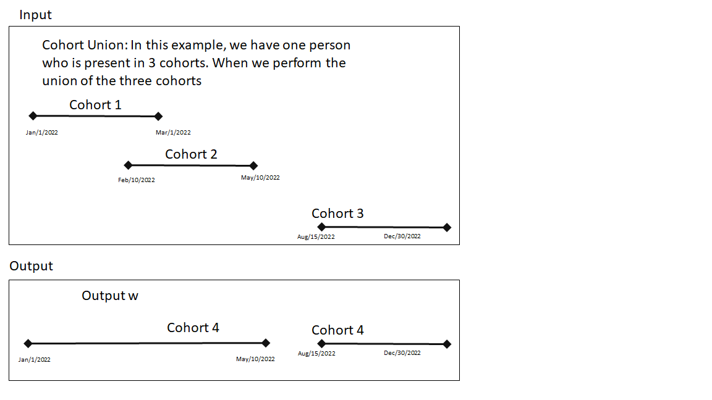
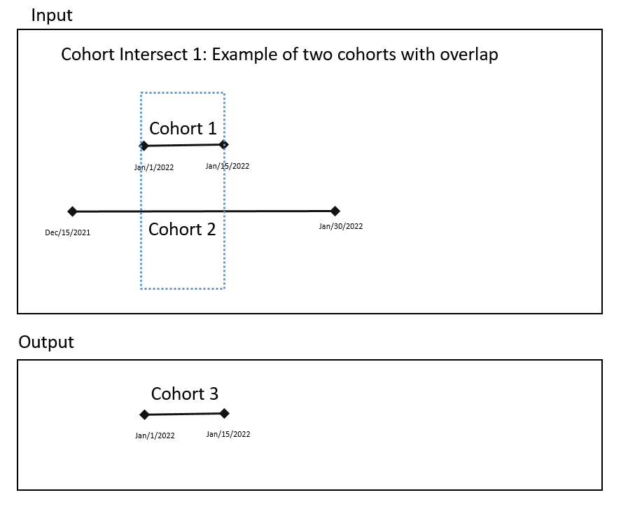
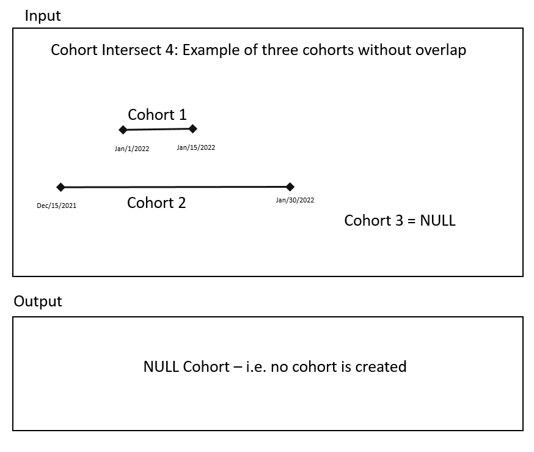
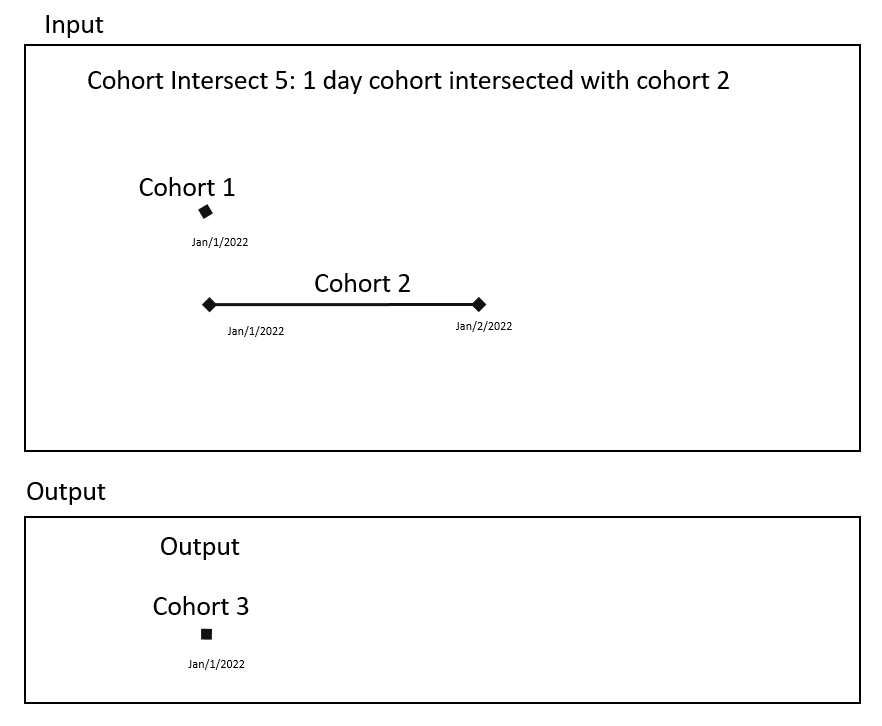
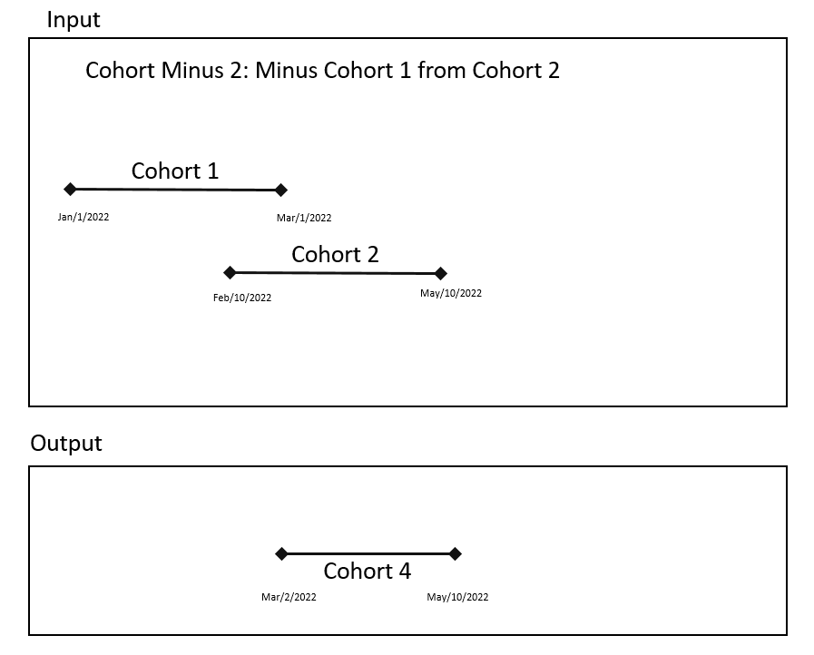

```{r, echo = FALSE, message = FALSE}
knitr::opts_chunk$set(
  cache = FALSE,
  comment = "#>",
  error = FALSE,
  tidy = FALSE
)
```


# Introduction

(This package is NOT part of HADES.)

The idea behind this package is to allow the construction of new cohorts from previously instantiated cohorts in the cohort table. All cohorts in OHDSI have a standard definition: "A cohort is a set of persons who satisfy one or more inclusion criteria for a duration of time."

- One person may belong to multiple cohorts
- One person may belong to the same cohort for multiple different time periods
- One person may not belong to the same cohort multiple times during the same period of time
- A cohort may have zero or more members

This is represented in a cohort table as cohort_definition_id, subject_id, cohort_start_date and cohort_end_date. For more details about the concept of a cohort please review [The Book of OHDSI](https://github.com/OHDSI/TheBookOfOhdsi).

This package allows the creation of new cohorts from previously instantiated cohort table using cohort algebra (similar to temporal set algebra). The output is one or more new cohorts.

## Installation
- This  is an installable R-package that may be installed as follows: 
```{r tidy=FALSE,eval=FALSE}
remotes::install_github("OHDSI/CohortAlgebra")
```

```{r tidy=FALSE,eval=TRUE, echo=FALSE}
library(dplyr)

jdbcDriverFolder <- tempfile("jdbcDrivers")
dir.create(jdbcDriverFolder, showWarnings = FALSE)
DatabaseConnector::downloadJdbcDrivers("postgresql", pathToDriver = jdbcDriverFolder)

connectionDetails <- DatabaseConnector::createConnectionDetails(
  dbms = "postgresql",
  user = Sys.getenv("CDM5_POSTGRESQL_USER"),
  password = Sys.getenv("CDM5_POSTGRESQL_PASSWORD"),
  server = Sys.getenv("CDM5_POSTGRESQL_SERVER"),
  pathToDriver = jdbcDriverFolder
)
cohortDatabaseSchema <- Sys.getenv("CDM5_POSTGRESQL_OHDSI_SCHEMA")

# generate unique name for a cohort table
sysTime <- as.numeric(Sys.time()) * 100000
tableName <- paste0("cr", sysTime)
tempTableName <- paste0("#", tableName, "_1")
```

## Cohort UNION
- Given two or more cohorts, an UNION operator on these cohorts creates a new cohort with continuous days the persons was present in any of the cohorts. For example: given a cohort table as follows

```{r tidy=FALSE,eval=TRUE, echo=FALSE}
cohort <- dplyr::tibble(
  cohortDefinitionId = c(1, 2, 2),
  subjectId = c(1, 1, 1),
  cohortStartDate = c(
    as.Date("2022-01-01"),
    as.Date("2022-02-10"),
    as.Date("2022-08-15")
  ),
  cohortEndDate = c(
    as.Date("2022-03-01"),
    as.Date("2022-05-10"),
    as.Date("2022-12-30")
  )
)
```

```{r tidy=FALSE,eval=TRUE, echo=TRUE}
cohort
```

```{r tidy=FALSE,eval=TRUE, echo=FALSE}
# upload table
connection <-
  DatabaseConnector::connect(connectionDetails = connectionDetails)
DatabaseConnector::insertTable(
  connection = connection,
  databaseSchema = cohortDatabaseSchema,
  tableName = tableName,
  data = cohort,
  dropTableIfExists = TRUE,
  createTable = TRUE,
  tempTable = FALSE,
  camelCaseToSnakeCase = TRUE,
  progressBar = FALSE
)
```

The union of the two cohorts is expected to give us


```{r tidy=FALSE,eval=TRUE, echo=FALSE}
cohortExpected <- dplyr::tibble(
  cohortDefinitionId = c(3, 3),
  subjectId = c(1, 1),
  cohortStartDate = c(as.Date("2022-01-01"), as.Date("2022-08-15")),
  cohortEndDate = c(as.Date("2022-05-10"), as.Date("2022-12-30"))
)
```

```{r tidy=FALSE, eval=TRUE, echo=TRUE}
cohortExpected
```


To perform Cohort Union, we use the unionCohorts function. This function requires as an input a data.frame called oldToNewCohortId. Here we specify the cohort id's of the cohorts we want to union. The newCohortId is the cohortId of the resultant cohort. The oldCohortId are cohorts that are already in the cohort table. 


```{r tidy=FALSE,eval=TRUE}
oldToNewCohortId <-
  dplyr::tibble(
    oldCohortId = c(1, 2, 2),
    newCohortId = c(3, 3, 3)
  )

CohortAlgebra::unionCohorts(
  connection = connection,
  sourceCohortDatabaseSchema = cohortDatabaseSchema,
  sourceCohortTable = tableName,
  targetCohortDatabaseSchema = cohortDatabaseSchema,
  targetCohortTable = tableName,
  oldToNewCohortId = oldToNewCohortId
)
```

Now we will have a new cohortId '3' which is the union of cohortId's 1 and 2.

```{r tidy=FALSE,eval=TRUE, echo=FALSE}
data <-
  DatabaseConnector::renderTranslateQuerySql(
    connection = connection,
    sql = paste0(
      "SELECT * FROM @cohort_database_schema.@table_name
        where cohort_definition_id = 3
        order by cohort_definition_id, subject_id, cohort_start_date;"
    ),
    cohort_database_schema = cohortDatabaseSchema,
    table_name = tableName,
    snakeCaseToCamelCase = TRUE
  ) |>
  dplyr::tibble()
```

```{r tidy=FALSE,eval=TRUE, echo=TRUE}
data
```

Note: if the target cohort table had a cohort with cohortId = 3, before running the union function - this would cause a conflict. In those cases, the union function would not run. We can purge all records for cohortId = 3 from the target cohort table. The parameter purgeConflicts will delete any cohort records in the cohort table where cohortId is the cohortId of the newCohort.


## InterSect Cohort
- Given two or more cohorts, an INTERSECT operator on these cohorts creates a new cohort with continuous days the persons was present in ALL of the cohorts.

### Intersect cohort example 1

Input:

```{r tidy=FALSE,eval=TRUE, echo=FALSE}
cohort <- dplyr::tibble(
  cohortDefinitionId = c(1, 2),
  subjectId = c(1, 1),
  cohortStartDate = c(
    as.Date("2022-01-01"),
    as.Date("2021-12-15")
  ),
  cohortEndDate = c(
    as.Date("2022-01-15"),
    as.Date("2022-01-30")
  )
)
```

```{r tidy=FALSE,eval=TRUE, echo=TRUE}
cohort
```


```{r tidy=FALSE,eval=TRUE, echo=FALSE}
DatabaseConnector::insertTable(
  connection = connection,
  databaseSchema = cohortDatabaseSchema,
  tableName = tableName,
  data = cohort,
  dropTableIfExists = TRUE,
  createTable = TRUE,
  tempTable = FALSE,
  camelCaseToSnakeCase = TRUE,
  progressBar = FALSE
)
```

```{r tidy=FALSE,eval=TRUE, echo=TRUE}
CohortAlgebra::intersectCohorts(
  connection = connection,
  sourceCohortDatabaseSchema = cohortDatabaseSchema,
  sourceCohortTable = tableName,
  targetCohortDatabaseSchema = cohortDatabaseSchema,
  targetCohortTable = tableName,
  cohortIds = c(1, 2),
  newCohortId = 3
)
```



Output

```{r tidy=FALSE,eval=TRUE, echo=FALSE}
data <-
  DatabaseConnector::renderTranslateQuerySql(
    connection = connection,
    sql = paste0(
      "SELECT * FROM @cohort_database_schema.@table_name
        where cohort_definition_id = 3
        order by cohort_definition_id, subject_id, cohort_start_date;"
    ),
    cohort_database_schema = cohortDatabaseSchema,
    table_name = tableName,
    snakeCaseToCamelCase = TRUE
  ) |>
  dplyr::tibble()
```


```{r tidy=FALSE,eval=TRUE, echo=FALSE}
data
```

### Intersect cohort example 2

Input:

```{r tidy=FALSE,eval=TRUE, echo=FALSE}
cohort <- dplyr::tibble(
  cohortDefinitionId = c(1, 2, 2),
  subjectId = c(1, 1, 1),
  cohortStartDate = c(
    as.Date("2022-01-01"),
    as.Date("2021-12-15"),
    as.Date("2022-01-10")
  ),
  cohortEndDate = c(
    as.Date("2022-01-15"),
    as.Date("2022-01-05"),
    as.Date("2022-01-30")
  )
)
```

```{r tidy=FALSE,eval=TRUE, echo=TRUE}
cohort
```


```{r tidy=FALSE,eval=TRUE, echo=FALSE}
DatabaseConnector::insertTable(
  connection = connection,
  databaseSchema = cohortDatabaseSchema,
  tableName = tableName,
  data = cohort,
  dropTableIfExists = TRUE,
  createTable = TRUE,
  tempTable = FALSE,
  camelCaseToSnakeCase = TRUE,
  progressBar = FALSE
)
```

```{r tidy=FALSE,eval=TRUE, echo=TRUE}
CohortAlgebra::intersectCohorts(
  connection = connection,
  sourceCohortDatabaseSchema = cohortDatabaseSchema,
  sourceCohortTable = tableName,
  targetCohortDatabaseSchema = cohortDatabaseSchema,
  targetCohortTable = tableName,
  cohortIds = c(1, 2),
  newCohortId = 3
)
```


Output

```{r tidy=FALSE,eval=TRUE, echo=FALSE}
data <-
  DatabaseConnector::renderTranslateQuerySql(
    connection = connection,
    sql = paste0(
      "SELECT * FROM @cohort_database_schema.@table_name
        where cohort_definition_id = 3
        order by cohort_definition_id, subject_id, cohort_start_date;"
    ),
    cohort_database_schema = cohortDatabaseSchema,
    table_name = tableName,
    snakeCaseToCamelCase = TRUE
  ) |>
  dplyr::tibble()
```


```{r tidy=FALSE,eval=TRUE, echo=FALSE}
data
```


### Intersect cohort example 3

Input:

```{r tidy=FALSE,eval=TRUE, echo=FALSE}
cohort <- dplyr::tibble(
  cohortDefinitionId = c(1, 2, 3),
  subjectId = c(1, 1, 1),
  cohortStartDate = c(
    as.Date("2022-01-01"),
    as.Date("2021-12-15"),
    as.Date("2022-03-01")
  ),
  cohortEndDate = c(
    as.Date("2022-01-15"),
    as.Date("2022-01-30"),
    as.Date("2022-03-15")
  )
)
```

```{r tidy=FALSE,eval=TRUE, echo=TRUE}
cohort
```


```{r tidy=FALSE,eval=TRUE, echo=FALSE}
DatabaseConnector::insertTable(
  connection = connection,
  databaseSchema = cohortDatabaseSchema,
  tableName = tableName,
  data = cohort,
  dropTableIfExists = TRUE,
  createTable = TRUE,
  tempTable = FALSE,
  camelCaseToSnakeCase = TRUE,
  progressBar = FALSE
)
```

```{r tidy=FALSE,eval=TRUE, echo=TRUE}
CohortAlgebra::intersectCohorts(
  connection = connection,
  sourceCohortDatabaseSchema = cohortDatabaseSchema,
  sourceCohortTable = tableName,
  targetCohortDatabaseSchema = cohortDatabaseSchema,
  targetCohortTable = tableName,
  cohortIds = c(1, 2, 3),
  newCohortId = 4
)
```


Output

```{r tidy=FALSE,eval=TRUE, echo=FALSE}
data <-
  DatabaseConnector::renderTranslateQuerySql(
    connection = connection,
    sql = paste0(
      "SELECT * FROM @cohort_database_schema.@table_name
        where cohort_definition_id = 4
        order by cohort_definition_id, subject_id, cohort_start_date;"
    ),
    cohort_database_schema = cohortDatabaseSchema,
    table_name = tableName,
    snakeCaseToCamelCase = TRUE
  ) |>
  dplyr::tibble()
```


```{r tidy=FALSE,eval=TRUE, echo=FALSE, echo=TRUE}
data
```


### Intersect cohort example 4

Input:

```{r tidy=FALSE,eval=TRUE, echo=FALSE}
cohort <- dplyr::tibble(
  cohortDefinitionId = c(1, 2),
  subjectId = c(1, 1),
  cohortStartDate = c(
    as.Date("2022-01-01"),
    as.Date("2021-12-15")
  ),
  cohortEndDate = c(
    as.Date("2022-01-15"),
    as.Date("2022-01-30")
  )
)
```


```{r tidy=FALSE,eval=TRUE, echo=TRUE}
cohort
```

```{r tidy=FALSE,eval=TRUE, echo=FALSE}
DatabaseConnector::insertTable(
  connection = connection,
  databaseSchema = cohortDatabaseSchema,
  tableName = tableName,
  data = cohort,
  dropTableIfExists = TRUE,
  createTable = TRUE,
  tempTable = FALSE,
  camelCaseToSnakeCase = TRUE,
  progressBar = FALSE
)
```

```{r tidy=FALSE,eval=TRUE, echo=TRUE}
CohortAlgebra::intersectCohorts(
  connection = connection,
  sourceCohortDatabaseSchema = cohortDatabaseSchema,
  sourceCohortTable = tableName,
  targetCohortDatabaseSchema = cohortDatabaseSchema,
  targetCohortTable = tableName,
  cohortIds = c(1, 2, 3),
  newCohortId = 4
)
```



Output

```{r tidy=FALSE,eval=TRUE, echo=FALSE}
data <-
  DatabaseConnector::renderTranslateQuerySql(
    connection = connection,
    sql = paste0(
      "SELECT * FROM @cohort_database_schema.@table_name
        where cohort_definition_id = 4
        order by cohort_definition_id, subject_id, cohort_start_date;"
    ),
    cohort_database_schema = cohortDatabaseSchema,
    table_name = tableName,
    snakeCaseToCamelCase = TRUE
  ) |>
  dplyr::tibble()
```


```{r tidy=FALSE,eval=TRUE, echo=TRUE}
data
```

### Intersect cohort example 5


Input:

```{r tidy=FALSE,eval=TRUE,echo=FALSE}
cohort <- dplyr::tibble(
  cohortDefinitionId = c(1, 2),
  subjectId = c(1, 1),
  cohortStartDate = c(
    as.Date("2022-01-01"),
    as.Date("2022-01-01")
  ),
  cohortEndDate = c(
    as.Date("2022-01-01"),
    as.Date("2022-01-02")
  )
)
```


```{r tidy=FALSE,eval=TRUE, echo=TRUE}
cohort
```


```{r tidy=FALSE,eval=TRUE, echo=FALSE}
DatabaseConnector::insertTable(
  connection = connection,
  databaseSchema = cohortDatabaseSchema,
  tableName = tableName,
  data = cohort,
  dropTableIfExists = TRUE,
  createTable = TRUE,
  tempTable = FALSE,
  camelCaseToSnakeCase = TRUE,
  progressBar = FALSE
)
```

```{r tidy=FALSE,eval=TRUE, echo=TRUE}
CohortAlgebra::intersectCohorts(
  connection = connection,
  sourceCohortDatabaseSchema = cohortDatabaseSchema,
  sourceCohortTable = tableName,
  targetCohortDatabaseSchema = cohortDatabaseSchema,
  targetCohortTable = tableName,
  cohortIds = c(1, 2),
  newCohortId = 3
)
```



Output

```{r tidy=FALSE,eval=TRUE, echo=FALSE}
data <-
  DatabaseConnector::renderTranslateQuerySql(
    connection = connection,
    sql = paste0(
      "SELECT * FROM @cohort_database_schema.@table_name
        where cohort_definition_id = 3
        order by cohort_definition_id, subject_id, cohort_start_date;"
    ),
    cohort_database_schema = cohortDatabaseSchema,
    table_name = tableName,
    snakeCaseToCamelCase = TRUE
  ) |>
  dplyr::tibble()
```


```{r tidy=FALSE,eval=TRUE, echo=TRUE}
data
```

## Minus Cohort


Input:

```{r tidy=FALSE,eval=TRUE, echo=FALSE}
cohort <- dplyr::tibble(
  cohortDefinitionId = c(1, 2),
  subjectId = c(1, 1),
  cohortStartDate = c(
    as.Date("2022-01-01"),
    as.Date("2022-02-10")
  ),
  cohortEndDate = c(
    as.Date("2022-03-01"),
    as.Date("2022-05-10")
  )
)
```


```{r tidy=FALSE,eval=TRUE, echo=TRUE}
cohort
```


```{r tidy=FALSE,eval=TRUE, echo=FALSE}
DatabaseConnector::insertTable(
  connection = connection,
  databaseSchema = cohortDatabaseSchema,
  tableName = tableName,
  data = cohort,
  dropTableIfExists = TRUE,
  createTable = TRUE,
  tempTable = FALSE,
  camelCaseToSnakeCase = TRUE,
  progressBar = FALSE
)
```

```{r tidy=FALSE,eval=TRUE, echo=TRUE}
CohortAlgebra::minusCohorts(
  connection = connection,
  sourceCohortDatabaseSchema = cohortDatabaseSchema,
  sourceCohortTable = tableName,
  targetCohortDatabaseSchema = cohortDatabaseSchema,
  targetCohortTable = tableName,
  firstCohortId = 1,
  secondCohortId = 2,
  newCohortId = 3
)
```


Output for example 1

```{r tidy=FALSE,eval=TRUE, echo=FALSE}
data <-
  DatabaseConnector::renderTranslateQuerySql(
    connection = connection,
    sql = paste0(
      "SELECT * FROM @cohort_database_schema.@table_name
        where cohort_definition_id = 3
        order by cohort_definition_id, subject_id, cohort_start_date;"
    ),
    cohort_database_schema = cohortDatabaseSchema,
    table_name = tableName,
    snakeCaseToCamelCase = TRUE
  ) |>
  dplyr::tibble()
```


```{r tidy=FALSE,eval=TRUE, echo=TRUE}
data
```

But if the cohorts are switched, i.e. minus cohort 1 from Cohort 2


```{r tidy=FALSE,eval=TRUE, echo=TRUE}
CohortAlgebra::minusCohorts(
  connection = connection,
  sourceCohortDatabaseSchema = cohortDatabaseSchema,
  sourceCohortTable = tableName,
  targetCohortDatabaseSchema = cohortDatabaseSchema,
  targetCohortTable = tableName,
  firstCohortId = 2,
  secondCohortId = 1,
  newCohortId = 4
)
```



Output

```{r tidy=FALSE,eval=TRUE, echo=FALSE}
data <-
  DatabaseConnector::renderTranslateQuerySql(
    connection = connection,
    sql = paste0(
      "SELECT * FROM @cohort_database_schema.@table_name
        where cohort_definition_id = 4
        order by cohort_definition_id, subject_id, cohort_start_date;"
    ),
    cohort_database_schema = cohortDatabaseSchema,
    table_name = tableName,
    snakeCaseToCamelCase = TRUE
  ) |>
  dplyr::tibble()
```

```{r tidy=FALSE,eval=TRUE, echo=TRUE}
data
```

Sequence of cohorts are important for minusCohort

```{r tidy=FALSE,eval=TRUE, echo=FALSE}
unlink(jdbcDriverFolder)
DatabaseConnector::renderTranslateExecuteSql(
  connection = connection,
  sql = "DROP TABLE IF EXISTS @cohort_table;",
  cohort_table = tableName,
  progressBar = FALSE,
  reportOverallTime = FALSE
)
```

